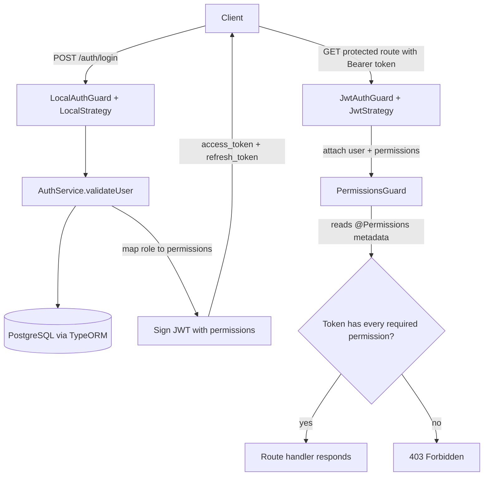

<div align="center">

# nestjs-passport-CBAC


**A NestJS example that protects routes with claim-based (permission) access control using Passport, JWT, and PostgreSQL.**

<!-- TODO: screenshot/GIF - a Postman run showing login returning a JWT, then a 200 on /admin-only and a 403 on a denied route -->

</div>

> Note: This is a learning and reference project. It shows one clear way to wire up claim-based access control in NestJS. Read the Roadmap and Security notes before using any of it in production.

## Table of Contents

- [About](#about)
- [Features](#features)
- [Tech Stack](#tech-stack)
- [Architecture](#architecture)
- [Getting Started](#getting-started)
- [API Endpoints](#api-endpoints)
- [Project Structure](#project-structure)
- [Configuration](#configuration)
- [Security Notes](#security-notes)
- [Roadmap](#roadmap)
- [Contributing](#contributing)
- [License](#license)

## About

This project is a small NestJS API that demonstrates claim-based access control (CBAC), also called permission-based access control. Instead of checking a single role on each route, the app gives every signed-in account a list of permissions and then checks those permissions when a request hits a protected route.

Authentication is handled by Passport. A local strategy validates a username and password at login, and a JWT strategy validates the bearer token on later requests. When a user logs in, their role (`user` or `admin`) is mapped to a set of permissions, and that permission list is placed inside the JWT. Each protected route declares the permissions it needs with a `@Permissions()` decorator, and a `PermissionsGuard` allows the request only when the token carries every required permission.

There are two account types, `User` and `Admin`, each stored in PostgreSQL through TypeORM. Both can sign up and log in through the same auth flow.

## Features

- Claim-based access control with a `@Permissions()` decorator and a `PermissionsGuard`.
- Passport local strategy for username and password login.
- Passport JWT strategy for stateless bearer-token auth on protected routes.
- Permissions encoded directly in the JWT payload, so route checks need no extra database lookup.
- Separate `User` and `Admin` entities that share one login flow.
- Password hashing with bcrypt.
- Access token plus refresh token, with a refresh endpoint to mint a new access token.
- PostgreSQL persistence through TypeORM.

## Tech Stack

| Layer | Technology |
|-------|-----------|
| Runtime | Node.js |
| Language | TypeScript |
| Framework | NestJS 10 |
| Auth | Passport (`passport-local`, `passport-jwt`), `@nestjs/jwt` |
| Hashing | bcrypt |
| Database | PostgreSQL |
| ORM | TypeORM |
| Testing | Jest, Supertest |

## Architecture

The diagram below shows how a request flows through login and then through a permission-protected route.



## Getting Started

### Prerequisites

```bash
node --version   # Node.js 18 or newer is recommended
npm --version
# A running PostgreSQL instance and a database for this app
```

### Installation

```bash
git clone https://github.com/atiqbitstream/nestjs-passport-CBAC.git
cd nestjs-passport-CBAC
npm install
```

Create a `.env` file in the project root with your database settings (see [Configuration](#configuration)).

### Run

```bash
npm run start:dev
```

The server starts on `http://localhost:3000`. TypeORM runs with `synchronize: true`, so the `User` and `Admin` tables are created automatically on first run.

### Tests

```bash
npm run test       # unit tests
npm run test:e2e   # end-to-end tests
npm run test:cov   # coverage
```

## API Endpoints

All routes are served from `http://localhost:3000`.

| Method | Path | Auth | Description |
|--------|------|------|-------------|
| POST | `/users/signup` | None | Create a user account (`username`, `password`, `email`, `role`). |
| POST | `/admin/signup` | None | Create an admin account (`username`, `password`, `email`, `role`). |
| POST | `/auth/login` | Local | Log in with `username` and `password`; returns `access_token` and `refresh_token`. |
| GET | `/profile` | JWT | Return the decoded user from the token. |
| GET | `/admin-only` | JWT + Permissions | Requires `GENERAL_ADMIN_PERMISSION`. |
| GET | `/user-only` | JWT + Permissions | Requires `GENERAL_USER_PERMISSION`. |
| GET | `/admin-or-user` | JWT + Permissions | Requires both general permissions. |
| POST | `/refresh` | Refresh token | Send `refresh_token` in the body to get a new `access_token`. |

Send the access token as a header on protected routes:

```http
Authorization: Bearer <access_token>
```

### Permissions

Permissions are defined as an enum in `src/auth/permissions.decorator.ts`:

- `GENERAL_ADMIN_PERMISSION`
- `GENERAL_USER_PERMISSION`
- `BLOCK_USER`

At login, an `admin` account receives all three permissions, and a `user` account receives `GENERAL_USER_PERMISSION`.

## Project Structure

```text
src/
  main.ts                       App bootstrap, listens on port 3000
  app.module.ts                 Root module, TypeORM and config setup
  app.controller.ts             Login, profile, and permission-protected routes
  auth/
    auth.module.ts              Passport and JWT wiring
    auth.service.ts             Credential check, permission mapping, token signing
    local.strategy.ts           Username and password validation
    jwt.strategy.ts             Bearer token validation
    local-auth.guard.ts         Guard for the local strategy
    jwt-auth.guard.ts           Guard for the JWT strategy
    permissions.decorator.ts    @Permissions decorator and Permission enum
    permissions.guard.ts        Checks required permissions against the token
    constants.ts                JWT secret (placeholder, see Security Notes)
    userWithPermission.dto.ts   User shape with an attached permissions list
  users/                        User entity, service, controller, signup DTO
  Admin/                        Admin entity, service, controller, signup DTO
```

## Configuration

Add a `.env` file in the project root. These variables feed the TypeORM PostgreSQL connection in `app.module.ts`.

| Variable | Description | Example |
|----------|-------------|---------|
| `DB_HOST` | PostgreSQL host | `localhost` |
| `DB_PORT` | PostgreSQL port | `5432` |
| `DB_USERNAME` | Database user | `postgres` |
| `DB_PASSWORD` | Database password | `your_password` |
| `DB_DATABASE` | Database name | `passportdb` |

## Security Notes

This is a demo, so a few settings are convenient rather than safe for production:

- The JWT secret is a hardcoded placeholder in `src/auth/constants.ts`. Move it to an environment variable and use a strong, secret value before any real deployment.
- TypeORM runs with `synchronize: true`, which can change your schema automatically. Use migrations in production.
- The access token lifetime is 60 seconds, which is short for normal use. Adjust the `expiresIn` value in `auth.service.ts` and the JWT module setup to fit your needs.

## Roadmap

- [ ] Read the JWT secret from an environment variable instead of `constants.ts`.
- [ ] Add input validation with `class-validator` on the signup DTOs.
- [ ] Persist permissions on the entities so they are not derived only from role at login.
- [ ] Replace `synchronize: true` with TypeORM migrations.
- [ ] Add a logout and refresh-token revocation flow.
- [ ] Ship a `.env.example` file.

## Contributing

Contributions and suggestions are welcome. Open an issue to discuss a change, or send a pull request with a clear description of what it does.

## License

Distributed under the MIT License. See [LICENSE](LICENSE) for details.
